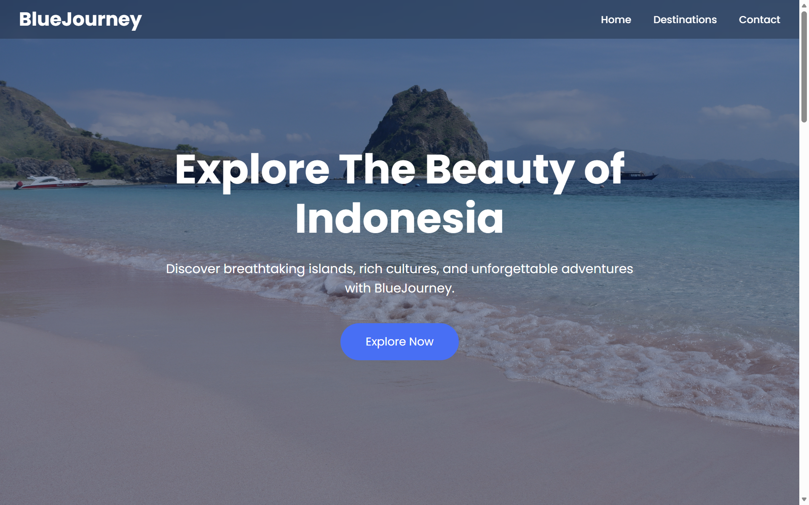
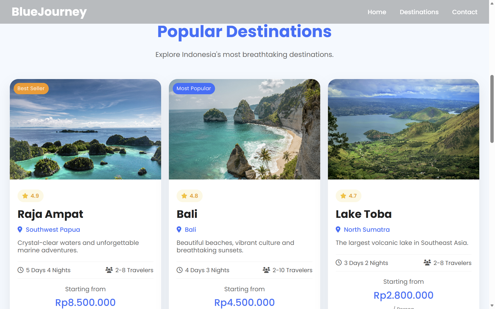
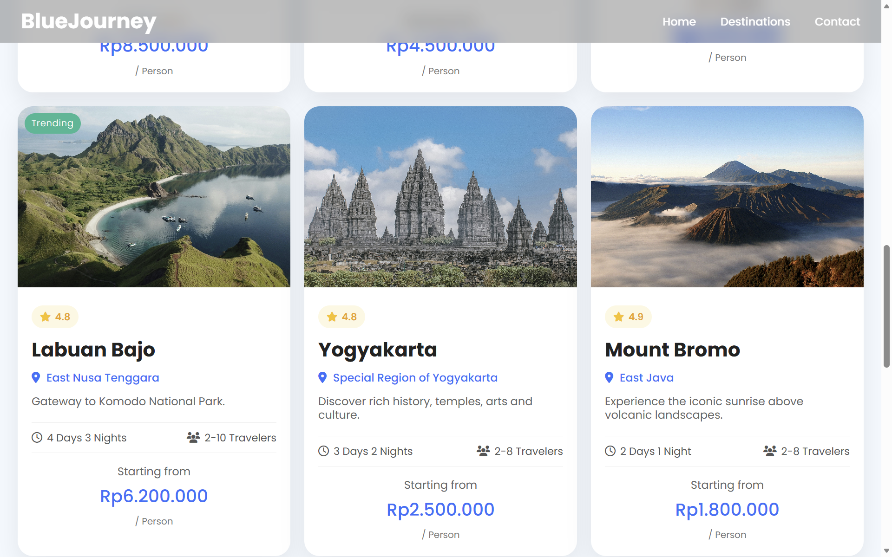

# BlueJourney

BlueJourney is a modern and responsive travel website that showcases some of Indonesia's most beautiful tourist destinations. This project was created as a Web Development portfolio using HTML, CSS, and JavaScript without any backend or database.

## Features

- Responsive Design
- Modern Blue Theme
- Hero Section
- Popular Destinations
- Why Choose Us Section
- Smooth Scrolling Navigation
- Responsive Navigation Menu
- Footer with Social Media Icons

## Technologies Used

- HTML5
- CSS3
- JavaScript
- Font Awesome

## How to Run

1. Download or clone this repository.
2. Open the project using Visual Studio Code.
3. Install the Live Server extension (if not already installed).
4. Right-click `index.html`.
5. Select **Open with Live Server**.

## Project Structure

BlueJourney/
│
├── index.html
├── README.md
│
├── css/
│   └── style.css
│
├── js/
│   └── script.js
│
├── images/
│   ├── bali.jpg
│   ├── bromo.jpg
│   ├── danau-toba.jpg
│   ├── hero.jpg
│   ├── labuan-bajo.jpg
│   ├── raja-ampat.jpg
│   └── yogyakarta.jpg
│
└── Screenshots/
    ├── home-page.png
    ├── about.png
    ├── destinations1.png
    ├── destinations2.png
    └── footer.png

## Screenshots

### Home Page

### Popular Destinations

### Why Choose Us

### Footer

## Photo Credits

This project uses photos from Unsplash.

- Hero Image  
  Photo by Hongbin on Unsplash  
  https://unsplash.com/photos/pink-beach-with-clear-water-under-a-blue-sky-4t8ar23MmJs

- Raja Ampat  
  Photo by sutirta budiman on Unsplash  
  https://unsplash.com/photos/islets-surrounded-by-body-of-water-during-daytime-DxmBSgUYKis

- Bali  
  Photo by Alfiano Sutianto on Unsplash  
  https://unsplash.com/photos/island-under-white-sky-exFdOWkYBQw

- Labuan Bajo  
  Photo by dwi damarnesia on Unsplash  
  https://unsplash.com/photos/a-body-of-water-surrounded-by-mountains-GlxYs8WlgkU

- Lake Toba  
  Photo by Irfannur Diah on Unsplash  
  https://unsplash.com/photos/green-mountains-near-body-of-water-during-daytime-PquBsLA8tKM

- Yogyakarta  
  Photo by Eugenia Clara (@fleetingstill) on Unsplash  
  https://unsplash.com/photos/angkor-wat-during-daytime-_QTeGT478_8

- Mount Bromo  
  Photo by Snowscat on Unsplash  
  https://unsplash.com/photos/brown-mountain-under-blue-sky-z5gpw7UqCvk

All photos remain the property of their respective photographers.

## Author

**Nur Annisa Balqis**

Created as a personal Web Development portfolio project.